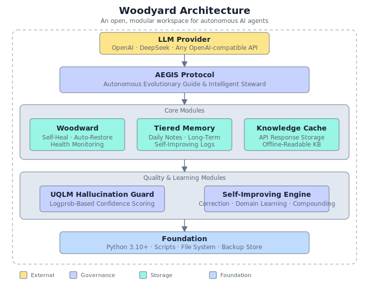

<p align="center">
  
</p>

<h3 align="center">Woodyard</h3>

<p align="center">
  An open workspace for autonomous AI agents.<br>
  Self-healing. Self-improving. Hallucination-aware. Community-driven.
</p>

<p align="center">
  <a href="#-modules">Modules</a> •
  <a href="#-quick-start">Quick Start</a> •
  <a href="#-contributing">Contributing</a> •
  <a href="#-vision">Vision</a>
</p>

**Woodyard is named after my dog Woody.**  
This workspace started as a personal project, an agent that learns from its mistakes, owns its uncertainty, and doesn't fall apart overnight. Over time it grew into a framework. Now it's yours too.

---

## What is Woodyard?

Think of it as a digital workshop where your agent has:

- A **personality** that's transparent, configurable, and shareable (SOUL.md)
- A **memory system** that's tiered, durable, and self-improving
- A **health framework** that detects problems and heals itself
- A **hallucination guard** that measures and flags uncertain outputs
- A **knowledge cache** that turns every API call into a local asset

Woodyard is not a black-box agent. It's an open blueprint. You see everything, you own everything, you shape everything.

---

## Architecture

<p align="center">
  
</p>

*Full-size: [assets/architecture.svg](assets/architecture.svg)*

### AEGIS Protocol
The operating system of an agent. A set of behavioral guidelines that govern how an agent thinks, decides, and communicates. Transparent, editable, version-controlled.

### Woodward (Self-Heal)
Health monitoring and self-recovery. Continuously validates critical files, detects corruption, auto-restores from backups. Designed for 24/7 unattended operation.

### Tiered Memory
Three tiers of persistence: daily logs, curated long-term memory, and execution improvement notes. Keeps agents context-aware across sessions without accumulating noise.

### Knowledge Cache
Every API response is cached locally. Reduces cost, enables offline operation, and builds a personal knowledge base over time.

### UQLM Guard
Zero-cost hallucination detection. Uses sequence probability from LLM logprobs to quantify output confidence. No separate NLI model, no API markup. Deployable in white-box and black-box modes.

### Self-Improving Engine
Agents learn from mistakes. Corrections, successes, and failures are logged, analyzed, and compounded into better future behavior.

---

## Modules

| Module | Status | Description |
|--------|--------|-------------|
| `self_check.py` | Stable | Health check on session start |
| `woodward/` | Stable | Self-heal and auto-restore framework |
| `uqlm_scorer.py` | Stable | Hallucination confidence scoring |
| `knowledge_cache.py` | Stable | API response caching |
| `memory/` | Stable | 3-tier memory system |
| `AGENTS.template.md` | Template | Workspace conventions |
| `HEARTBEAT.template.md` | Template | Periodic check procedures |
| `SOUL.md` | Showcase | Agent personality and rules |

### Planned

| Module | ETA | Description |
|--------|-----|-------------|
| Woodyard CLI | Q3 2026 | Command-line bootstrap and management |
| Plugin Registry | Q4 2026 | Community-submitted skill plugins |
| Dashboard | Q1 2027 | Web UI for agent introspection |
| Multi-agent orchestration | Q2 2027 | Coordinated agent teams |

---

## Quick Start

```bash
git clone https://github.com/blazin0115-Jake/woodyard.git
cd woodyard

# Run health check
python self_check.py

# Explore the framework
cat SOUL.md
cat AGENTS.template.md

# Test hallucination guard
python uqlm_scorer.py --demo
```

### Prerequisites

- Python 3.10+
- An LLM API key (OpenAI, DeepSeek, any OpenAI-compatible provider)
- (Optional) A configured OpenClaw, LangChain, or custom agent runtime

### Your First Agent Workspace

1. Copy the templates:
   ```
   cp AGENTS.template.md AGENTS.md
   cp HEARTBEAT.template.md HEARTBEAT.md
   cp TOOLS.template.md TOOLS.md
   ```
2. Replace `{{OWNER_NAME}}` and other placeholders with your values
3. Edit `SOUL.md` to match your agent's personality
4. Run `python self_check.py` to verify everything is connected

---

## Contributing

Woodyard is built by the community, for the community. We welcome contributors at every level.

### Most Wanted Contributions

- **Docker support** — Containerize the health checks and Woodward module
- **Modular skill packaging format** — Define a standard for reusable agent skills
- **Web dashboard** — Flask or React UI for agent introspection
- **Plugin registry** — Design the community plugin publishing workflow
- **Tests** — Unit tests and integration tests for core modules
- **Docs** — Tutorials, examples, and API documentation

### Ways to Contribute

- Report bugs with reproduction steps
- Suggest features or start discussions
- Submit PRs for code, docs, tests, or templates
- Write tutorials, blog posts, or examples
- Join design conversations in Issues and Discussions

Woodyard is fresh. 0 stars today. That's exactly the moment to get involved and shape the direction from day one.

---

## Vision

**For developers** — An open, extensible workspace you can clone, fork, and make your own in 5 minutes. No lock-in, no license fees, no black boxes.

**For the community** — A shared ecosystem of reusable agent components: memory strategies, personality templates, health frameworks, hallucination guards. Published, discussed, and improved together.

**For enterprises** — A battle-tested foundation for production agent deployments. Woodward self-healing, UQLM hallucination detection, and tiered memory provide the reliability, auditability, and transparency that enterprise use cases demand.

---

## License

GNU AGPL v3 — see [LICENSE](./LICENSE).

Copyright 2026 blazin0115-Jake. Free to use, modify, and distribute — any modified version running on a network must make its source code available to users.

---

## Contact

- **GitHub Issues** — Technical questions and bug reports
- **GitHub Discussions** — Feature ideas and community conversation
- **GitHub Profile** — [blazin0115-Jake](https://github.com/blazin0115-Jake)
- **Pull Requests** — Contributions welcome

---

<p align="center">
  <sub>Built with coffee and bad ideas that turned into good ones.</sub>
</p>
